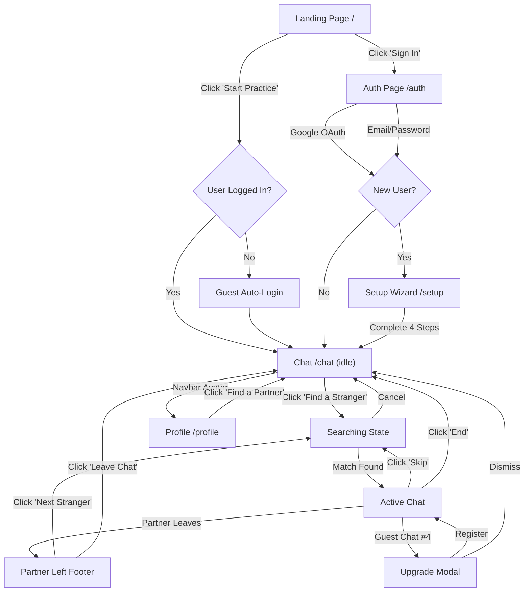
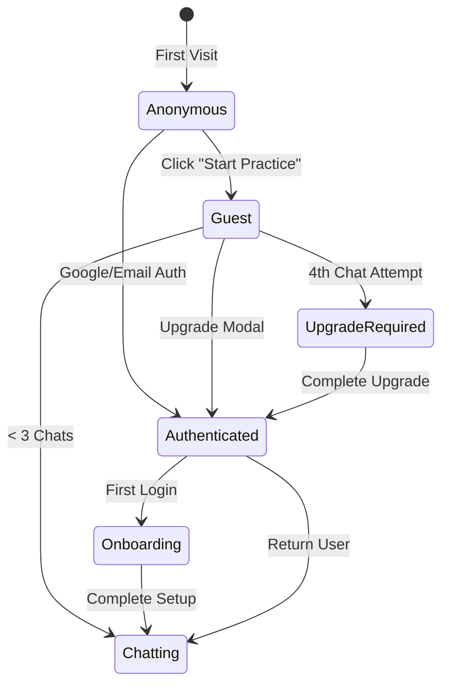
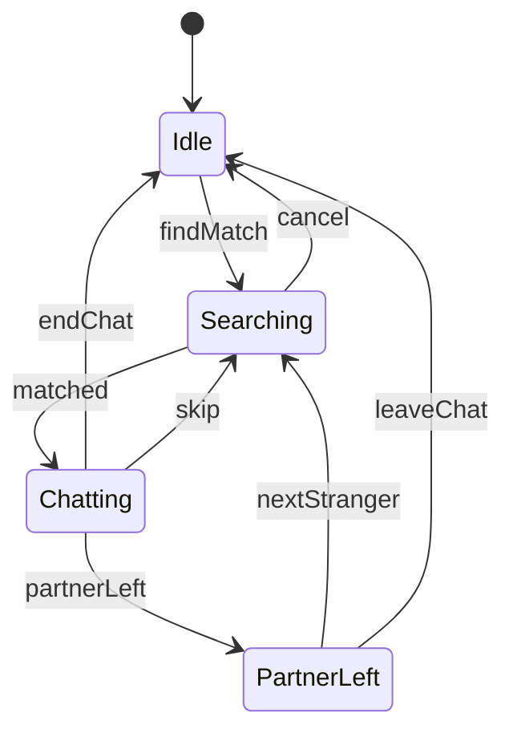

# LingoGen — UI/UX Design Specification & Roadmap

> **Version:** 2.0 · **Last Updated:** June 2026  
> **Audience:** UI/UX Designers, Visual Designers, Motion Designers  
> **Status:** Active Development

---

## Table of Contents

1. [Product Overview](#1-product-overview)
2. [Design Philosophy & Psychological Principles](#2-design-philosophy--psychological-principles)
3. [Brand Identity](#3-brand-identity)
4. [Design System & Tokens](#4-design-system--tokens)
5. [Typography System](#5-typography-system)
6. [Spacing & Layout Grid](#6-spacing--layout-grid)
7. [Iconography & Visual Assets](#7-iconography--visual-assets)
8. [Complete Screen Inventory](#8-complete-screen-inventory)
9. [Component Library](#9-component-library)
10. [Interaction & Motion Choreography](#10-interaction--motion-choreography)
11. [Responsive Strategy & Breakpoints](#11-responsive-strategy--breakpoints)
12. [Accessibility Standards](#12-accessibility-standards)
13. [User Flow Diagrams](#13-user-flow-diagrams)
14. [Design Handoff Checklist](#14-design-handoff-checklist)

---

## 1. Product Overview

**LingoGen** is a real-time, anonymous language exchange platform. It combines the spontaneous matchmaking of Omegle with the structured language-learning pairing of HelloTalk and Speak Pal.

### Core Value Propositions

| Pillar | Description |
|---|---|
| **Zero-Friction Entry** | Users can chat within seconds via Guest Mode — no registration wall |
| **Smart Matching** | Multi-factor scoring: language exchange compatibility (+50), shared interests (+10 each), intent alignment (+20), age proximity (+5) |
| **Full Anonymity** | Users appear as "Stranger" — no names, photos, or identity leaks |
| **Language Exchange** | Native ↔ Learning language pairing creates organic tutoring moments |

### Tech Stack Context (for design decisions)

- **Frontend:** Next.js 16 + TypeScript (App Router)
- **Backend:** FastAPI (Python) + Redis + PostgreSQL
- **Real-time:** WebSocket with auto-reconnect + heartbeat
- **Auth:** Google OAuth 2.0 + Email/Password + Guest Mode
- **Hosting:** Vercel (frontend) + Render (backend)

---

## 2. Design Philosophy & Psychological Principles

### 2.1 The Core Problem

Anonymous chat platforms create **social anxiety** through:
- Cold, clinical interfaces (pure black/white, sharp corners)
- Registration walls that kill momentum
- Conversational dead-ends when a stranger leaves
- No visual feedback during matchmaking (user feels abandoned)

### 2.2 Design Principles

| Principle | Implementation |
|---|---|
| **Warmth Over Sterility** | Soft radii (`12–24px`), warm gradient accents, ambient glow effects |
| **Instant Gratification** | Guest Mode bypasses all signup friction. First chat < 10 seconds |
| **Continuous Dopamine** | 1-click "Next Match" after stranger leaves. Never a dead screen |
| **Trust Through Transparency** | Live counters (online users, queue depth) reassure the user actively |
| **Reduced Cognitive Load** | Max 1 decision per wizard step. Progressive disclosure over info-dump |

### 2.3 Psychological Anchors

- **Social Proof:** Display live online counts ("142 learners online") prominently to signal an active community
- **Variable Reward:** Randomized ice breakers and unpredictable matches create Skinner-box engagement
- **Endowed Progress:** Show a 4-step progress bar during onboarding. User feels "75% done" on Step 3
- **Loss Aversion:** Guest mode limits to 3 chats, then prompts upgrade — users don't want to "lose" their session

---

## 3. Brand Identity

### 3.1 Brand Personality

```
Warm · Approachable · Intelligent · Anonymous · Global
```

LingoGen is **not** a dating app. It is **not** a trolling platform. The brand communicates safety, intellectual curiosity, and cultural exchange.

### 3.2 Logo System

The current logo is an SVG combining:
- A speech bubble shape (communication)
- Concentric arcs (global connectivity)
- Blue-to-Emerald gradient fill (brand colors)

The logo should be used in the following contexts:

| Context | Variant |
|---|---|
| Navbar (28×28px) | Full-color SVG, inline with "LingoGen" wordmark |
| Favicon (32×32px) | Simplified single-color icon |
| Auth Page Header | Gradient text wordmark only, no icon |
| Mobile Splash | Centered logo + wordmark, gradient background |

### 3.3 Naming Convention

- Product name: **LingoGen** (one word, capital L, capital G)
- Tagline: *"Learn & Chat Globally & Anonymously"*
- Users are referred to as **"Stranger"** in chat context
- Guest accounts display as **"Stranger#XXXX"** (4-digit random)

---

## 4. Design System & Tokens

### 4.1 Color Palette

#### Primary Colors

| Token | Hex | HSL | Usage |
|---|---|---|---|
| `--primary` | `#2563EB` | `217, 91%, 53%` | Primary actions, links, active states |
| `--primary-dark` | `#1D4ED8` | `219, 76%, 48%` | Hover states on primary buttons |
| `--primary-light` | `#60A5FA` | `213, 94%, 68%` | Tags, badges, secondary emphasis |
| `--accent` | `#10B981` | `160, 84%, 39%` | Success states, online indicators, accents |
| `--accent-2` | `#34D399` | `156, 64%, 52%` | Session counters, highlight stats |
| `--danger` | `#EF4444` | `0, 84%, 60%` | Destructive actions, errors |

#### Surface & Background

| Token | Hex | Usage |
|---|---|---|
| `--bg` | `#030712` | Page background (deep midnight) |
| `--bg-card` | `#0B1329` | Card surfaces, modals |
| `--bg-card-2` | `#1E293B` | Elevated card surfaces, tabs |
| `--bg-hover` | `#172554` | Hover states on interactive surfaces |

#### Text

| Token | Hex | Usage |
|---|---|---|
| `--text` | `#F8FAFC` | Primary text, headings |
| `--text-muted` | `#94A3B8` | Descriptions, secondary info |
| `--text-dim` | `#64748B` | Timestamps, captions, labels |

#### Borders

| Token | Hex | Usage |
|---|---|---|
| `--border` | `#1E293B` | Default borders |
| `--border-hover` | `#334155` | Hover state borders |

### 4.2 Gradients

| Name | Value | Usage |
|---|---|---|
| **Brand Gradient** | `linear-gradient(135deg, #3B82F6 0%, #10B981 100%)` | Primary CTAs, selected badges, own message bubbles, logo text |
| **Card Gradient** | `linear-gradient(180deg, rgba(11,19,41,0.8) 0%, rgba(3,7,18,0.9) 100%)` | Card overlays |
| **Ambient Glow** | `radial-gradient(circle at center, rgba(59,130,246,0.15) 0%, transparent 70%)` | Background ambiance |

### 4.3 Shadows

| Token | Value | Usage |
|---|---|---|
| `--shadow-sm` | `0 1px 2px rgba(0,0,0,0.05)` | Subtle depth |
| `--shadow-md` | `0 4px 6px rgba(0,0,0,0.1)` | Cards, navbar |
| `--shadow-lg` | `0 10px 15px rgba(0,0,0,0.1)` | Modals, dropdowns |
| `--shadow-glow` | `0 0 24px rgba(59,130,246,0.25)` | Glow emphasis on key elements |

### 4.4 Border Radii

| Token | Value | Usage |
|---|---|---|
| `--radius-sm` | `6px` | Small buttons, tags |
| `--radius-md` | `12px` | Cards, inputs, message bubbles |
| `--radius-lg` | `16px` | Large cards, modals |
| `--radius-xl` | `24px` | Auth card, hero panels |
| `--radius-full` | `9999px` | Avatars, pills, badges |

---

## 5. Typography System

### 5.1 Font Stack

```
Primary:  "Plus Jakarta Sans" (weights: 300–800)
Fallback: "Inter" → -apple-system → BlinkMacSystemFont → sans-serif
```

Both fonts are loaded from Google Fonts. **Plus Jakarta Sans** is used for all UI text. **Inter** is the fallback.

### 5.2 Type Scale

| Role | Size | Weight | Letter Spacing | Line Height | Usage |
|---|---|---|---|---|---|
| **Display** | `clamp(44px, 7vw, 80px)` | 400 / 800 (gradient span) | `-2px` | `1.15` | Hero headline only |
| **H1** | `30–32px` | 800 | `-0.8px` | `1.2` | Page titles (Setup, Idle, Profile) |
| **H2** | `24–36px` | 700–800 | `-0.5px` to `-1px` | `1.3` | Section headings, modal titles |
| **H3** | `17–20px` | 700 | `-0.2px` | `1.4` | Card titles, feature names |
| **Body** | `14–16px` | 400–500 | `0` | `1.6–1.7` | Descriptions, chat messages |
| **Caption** | `11–13px` | 500–600 | `0.5px` | `1.4` | Timestamps, tags, muted text |
| **Overline** | `10–11px` | 700 | `1–1.2px` | `1.2` | Form labels (`text-transform: uppercase`) |

### 5.3 Text Color Usage Rules

- **Headings:** Always `--text` (`#F8FAFC`)
- **Body descriptions:** `--text-muted` (`#94A3B8`)
- **Timestamps, labels, captions:** `--text-dim` (`#64748B`)
- **Gradient text:** Applied via `background: var(--gradient)` + `-webkit-background-clip: text` (brand name, hero headline accent)
- **Error text:** `--danger` (`#EF4444`)

---

## 6. Spacing & Layout Grid

### 6.1 Spacing Scale (Base: 4px)

| Token | Value | Common Usage |
|---|---|---|
| `4px` | Micro gap | Typing dots, inner padding |
| `8px` | XS | Icon gaps, tag gaps, badge padding-y |
| `12px` | SM | Button-sm padding, input gap |
| `16px` | MD | Card inner padding, nav gaps |
| `24px` | LG | Section padding, page horizontal padding |
| `32px` | XL | Card padding, form group spacing |
| `48px` | 2XL | Section title-to-content |
| `64px` | 3XL | Between major page sections |
| `100–120px` | Section | Vertical padding between landing sections |

### 6.2 Layout Container

```css
.container {
  max-width: 1200px;
  margin: 0 auto;
  padding: 0 24px;
}
```

### 6.3 Page-Specific Max Widths

| Page | Max Width | Reason |
|---|---|---|
| Landing Page | `1200px` | Full marketing layout |
| Auth Card | `450px` | Focused single-column form |
| Setup Wizard | `600px` | Comfortable reading width |
| Chat Idle Card | `480px` | Centered minimal card |
| Chat Active | `100%` viewport | Full-height immersive chat |
| Profile | `600px` | Single-column settings layout |

---

## 7. Iconography & Visual Assets

### 7.1 Emoji Usage

LingoGen uses native emoji as icons rather than custom SVG icon sets. This is intentional — emojis feel human, warm, and reduce development overhead.

| Context | Emojis Used |
|---|---|
| Feature Cards | 🌍 🎭 🎯 ⚡ 💡 🛡️ |
| Setup Steps | 👋 🎯 🌍 ✨ |
| Chat States | 🔍 (searching) · 🎉 (connected) · 👋 (partner left) |
| Navigation | 👤 (profile) · 🚪 (sign out) |
| Reactions | ❤️ 😂 👍 😮 😢 (reaction picker on messages) |
| Interest Tags | Text only, no emoji prefixes |

### 7.2 Background Effects

The landing page uses an `Interactive3DBackground` component — a Canvas-based particle animation with:
- Floating particles that respond to cursor position
- Gradient mesh connecting nearby particles
- Blue-emerald color scheme matching the brand

### 7.3 Required Visual Assets

| Asset | Format | Location | Notes |
|---|---|---|---|
| Favicon | `.ico` (32×32) | `/public/favicon.ico` | Already exists |
| OG Image | `.png` (1200×630) | `/public/og-image.png` | **Needed** — for social media previews |
| App Icon | `.svg` | Inline in Navbar | Already exists |
| Loading Skeleton | CSS animation | N/A | Shimmer gradient placeholder |

---

## 8. Complete Screen Inventory

LingoGen has **6 distinct screens** plus **3 modal overlays**. Below is a detailed specification for each.

---

### 8.1 Screen: Landing Page (`/`)

**Purpose:** Marketing page that converts visitors into active users.  
**Entry Points:** Direct URL, search engines, social links.  
**Primary Action:** "Start Practice — Free" → Guest login → Redirect to `/chat`

#### Layout Sections (Top to Bottom)

| # | Section | Content | Design Notes |
|---|---|---|---|
| 1 | **Floating Navbar** | Logo + "LingoGen" wordmark · "Find Partner" CTA (logged in) or "Sign In" (logged out) | Glassmorphic: `rgba(9,9,11,0.7)` + `backdrop-filter: blur(20px)` · Fixed position with `16px` inset from edges · `border-radius: 16px` |
| 2 | **Hero** | Live online counter badge · Display heading "Learn & Chat / Globally & Anonymously" · Subtitle · Two CTAs · Three stat counters (30+ Languages, 150k+ Chats/Day, 100% Safe & Free) | Full viewport height · Interactive 3D particle background behind content · Online counter uses emerald pulsing dot · Stats separated by `border-top` with `48px` padding |
| 3 | **Features Grid** | Section title "Engineered for Language Practice" · 6 feature cards in responsive grid | `grid-template-columns: repeat(auto-fit, minmax(320px, 1fr))` · Cards hover: lift `4px`, border turns `--primary` · Glassmorphic card background |
| 4 | **Journey Steps** | 3 alternating left/right sections with large gradient numbers (01, 02, 03) · Title + description · Placeholder illustration box | Zigzag layout: even rows left-to-right, odd rows reversed · Illustration boxes are dashed-border placeholders with emoji centers |
| 5 | **Bottom CTA Banner** | Glowing card with 💬 emoji · "Ready to master a language?" · Primary gradient button | Centered card, max-width `720px` · `box-shadow: var(--shadow-glow)` · `backdrop-filter: blur(20px)` |
| 6 | **Footer** | Brand wordmark · Copyright text | `border-top: 1px solid var(--border)` · Muted, minimal |

#### Key Interactions

- **Scroll Reveal:** All `.reveal` elements animate via `IntersectionObserver` — slide up with fade-in at `threshold: 0.15`
- **Hero CTA:** If logged in → navigates to `/chat`. If not → creates guest account, then navigates to `/chat`
- **Feature Card Hover:** `transform: translateY(-4px)` + border color shift to `--primary`

---

### 8.2 Screen: Auth Page (`/auth`)

**Purpose:** Email/password and Google authentication.  
**Entry Points:** Navbar "Sign In" button, redirect from `/chat` or `/setup` if unauthenticated.  

#### Layout

Centered single card (`max-width: 450px`) on a dark page with the floating navbar above.

#### Card Structure (Top to Bottom)

| Element | Specification |
|---|---|
| **Title** | "LingoGen" in gradient text (`26px`, weight 800) |
| **Subtitle** | "Interactive language exchange tailored to your interests." in `--text-muted` |
| **Tab Selector** | Two toggle buttons: "Sign In" / "Sign Up" · Background: `--bg-card-2` · Active tab: gradient background · `border-radius: --radius-sm` inside a `--radius-md` container |
| **Error Banner** | Conditionally shown. Red-tinted background (`rgba(239,68,68,0.05)`) + red border + `--danger` text |
| **Email Input** | Standard form input with uppercase label "EMAIL" |
| **Password Input** | Standard form input with uppercase label "PASSWORD" |
| **Confirm Password** | Only shown in "Sign Up" mode |
| **Submit Button** | Full-width gradient button. Text: "Sign In" or "Create Account" |
| **Divider** | Horizontal line with centered "OR" text |
| **Google Button** | Google Identity Services rendered button (theme: `filled_black`, shape: `pill`, width: `360px`) |
| **Terms Text** | "By continuing, you agree to LingoGen's Terms of Service..." in `--text-dim` |

#### Modal Overlay: Account Conflict

Triggered when user tries to register with an existing email.

- Full-screen dark backdrop with `blur(8px)`
- Centered card with 🌍 emoji, title "Account Already Exists", and two buttons: "Yes, Sign In" (gradient) / "No" (ghost)

---

### 8.3 Screen: Setup Wizard (`/setup`)

**Purpose:** 4-step onboarding that collects user profile data.  
**Entry Points:** After first Google/Email auth if `profile.onboarded === false`.

#### Progress Bar

- 4 segments, each a thin horizontal bar (`height: 4px`)
- States: `done` (solid `--primary`), `active` (light blue with glow shadow), default (`--border`)
- Centered, max-width `240px`
- "Step X of 4" caption below

#### Step Details

| Step | Title | Content | Validation |
|---|---|---|---|
| **Step 1** | "Tell us about yourself 👋" | Nickname text input · Age number input (13–99) · Gender selector (3-column grid: Male 👨, Female 👩, Other 🧑) | All fields required |
| **Step 2** | "What are you into? 🎯" | Interest badge selector. 30 badges in wrapped flex layout. Toggle selection. | Min 3 interests selected |
| **Step 3** | "Language Exchange 🌍" | Two dropdown `<select>` fields: "Your Native Language" and "Language You Want to Learn" · 22 options including "None" and "Other" | Optional (can leave as "None") |
| **Step 4** | "Almost there! ✨" | Bio textarea (300 char limit) · "Looking for" single-select list (5 options) | Optional |

#### Interest Badge Behavior

- Default: `border: 1px solid --border`, muted text, transparent background
- Hover: Border color shifts to `--primary-light`, text brightens
- Selected: `background: var(--gradient)`, white text, border disappears, `box-shadow` glow
- Counter text below: "X of 10 selected" in `--text-dim`

#### Navigation

- Bottom bar with "← Back" (ghost) and "Continue →" (primary gradient)
- Step 4: "Continue" becomes "🚀 Start Chatting"
- "Continue" is disabled until validation passes (`opacity: 0.4`, `cursor: not-allowed`)

---

### 8.4 Screen: Chat Page — Idle State (`/chat`, state: `idle`)

**Purpose:** Lobby screen shown before user starts searching.  
**Entry Points:** After setup, after ending a chat, returning to `/chat`.

#### Layout

Centered card (`max-width: 480px`) with vertical content stack.

#### Card Elements (Top to Bottom)

| Element | Specification |
|---|---|
| **Emoji** | 👋 at `56px`, centered |
| **Online Badge** | Emerald pulsing dot + "X people online" · Pill shape with emerald-tinted background and border |
| **Title** | "Ready to connect?" at `32px`, weight 800 |
| **Subtitle** | Description text in `--text-muted` |
| **Session Counter** | (After 1+ chats) Amber-tinted badge: "🔥 X chats this session" |
| **CTA Button** | "🔍 Find a Stranger" — full-width gradient button |
| **Interest Tags** | First 6 of user's interests as small purple-tinted pills |

---

### 8.5 Screen: Chat Page — Searching State (`/chat`, state: `searching`)

**Purpose:** Matchmaking lobby with visual feedback.  
**Rendered by:** `<MatchmakingSpinner>` component.

#### Layout

Centered card with spinner animation above text.

#### Spinner Design

Three concentric spinning rings:
- **Ring 1** (outermost, `110px`): `border-top-color: --primary`, spins at `1.5s`
- **Ring 2** (middle): `border-right-color: --accent`, spins reverse at `2.2s`
- **Ring 3** (inner): `border-bottom-color: --primary-light`, spins at `3s`
- **Center**: 🔍 emoji at `24px`

#### Text Content

| Element | Specification |
|---|---|
| **Title** | "Looking for a match..." at `26px`, weight 800 |
| **Subtitle** | Queue count: "X people in queue" in `--text-muted` |
| **Cancel Button** | Ghost button: "Cancel" |

---

### 8.6 Screen: Chat Page — Active Chat State (`/chat`, state: `chatting`)

**Purpose:** The core chat experience.  
**This is the most critical screen for user retention.**

#### Layout (Full-Height Flex Column)

```
┌──────────────────────────────────────┐
│  Chat Header                         │ ← Fixed height
├──────────────────────────────────────┤
│  Ice Breaker Bar (optional)          │ ← Dismissible
├──────────────────────────────────────┤
│                                      │
│  Messages Area (scrollable)          │ ← flex: 1
│                                      │
│  • System messages (centered)        │
│  • Stranger bubbles (left-aligned)   │
│  • Own bubbles (right-aligned)       │
│  • Typing indicator (bouncing dots)  │
│                                      │
├──────────────────────────────────────┤
│  Typing Indicator Text               │ ← "Stranger is typing..."
├──────────────────────────────────────┤
│  Input Area / Partner Left Footer    │ ← Fixed height
└──────────────────────────────────────┘
```

#### Chat Header

| Element | Specification |
|---|---|
| **Avatar** | 🎭 in a `42px` circle, `--bg-card-2` background, `--border` ring |
| **Name + Meta** | "Stranger · [age] · [gender]" + chat duration timer (`M:SS`) |
| **Language Info** | "🌍 Speaks [native] → Learning [learning]" in `--primary` |
| **Common Interests** | Tags: small uppercase pills (`10px`, `--primary-light`, emerald-blue border tint) |
| **Action Buttons** | "⏭ Skip" (ghost) · "✕ End" (danger outline) |

#### Message Bubbles

| Bubble Type | Background | Text | Border Radius | Alignment |
|---|---|---|---|---|
| **Own** | `var(--gradient)` | `#FFFFFF` | `12px 12px 0 12px` (tail bottom-right) | Right |
| **Stranger** | `--bg-card-2` | `--text` | `12px 12px 12px 0` (tail bottom-left) | Left |
| **System** | None | `--text-dim` | N/A | Center, uppercase, `11px`, `letter-spacing: 1px` |

Each bubble includes:
- Sender label: "You" / "Stranger" (uppercase, `10px`, `--text-dim`)
- Timestamp: `9.5px`, `opacity: 0.5`
- Reaction badge: emoji in a semi-transparent pill
- Reaction picker: row of emoji buttons, visible on hover (`opacity 0→1` transition)

#### Typing Indicator

Animated triple-dot bouncing pattern:
- 3 dots, `5px` diameter, `--text-dim` color
- Staggered `animation-delay`: 0s, 0.2s, 0.4s
- Keyframe: vertical bounce of `4px`

#### Input Area

- **Normal:** Textarea (auto-height, `min: 52px`, `max: 120px`) + gradient send button (`52px` square, "➤" icon)
- **Partner Left:** Replaces textarea with centered overlay:
  - Text: "Stranger has left the conversation."
  - Two buttons: "⏭ Next Stranger" (gradient) / "✕ Leave Chat" (ghost)

#### Ice Breaker Bar

- Shown at top of message area when matched
- 💡 icon + "**Ice breaker:** [random question]"
- Dismiss button (✕) on the right
- Background: `rgba(59,130,246,0.02)`, `border-bottom: 1px solid --border`

---

### 8.7 Screen: Profile Page (`/profile`)

**Purpose:** View and edit user profile settings.  
**Entry Points:** Navbar dropdown → "👤 Profile"

#### Layout Sections

| Section | Content |
|---|---|
| **Header** | Large avatar circle (`100px`) with initial or photo · Display name (`26px`, weight 800) · Meta: "Gender · Age X · Member since Month Year" · Looking-for label in `--primary-light` |
| **Stats Row** | 3-column grid separated by vertical borders: Interests count · 🔥 Active · 🌍 Global |
| **Profile Card** | "My Profile" heading + Edit/Save/Cancel buttons · View mode: Bio, Gender/Age, Language info · Edit mode: All fields as form inputs |
| **Interests Card** | View mode: Wrapped tags with gradient background. Edit mode: Full `InterestSelector` grid |
| **Bottom CTA** | "🔍 Find a Partner" full-width gradient button → navigates to `/chat` |

#### Edit Mode Toggle

- "✏️ Edit" secondary button → switches all display fields to editable inputs
- "Cancel" (ghost) + "Save" (primary) replace the edit button
- Save triggers API call with loading state

---

### 8.8 Modal: Guest Upgrade Prompt

**Trigger:** Guest user attempts to start 4th chat (after 3-chat limit).

#### Design

- Full-screen dark backdrop (`rgba(0,0,0,0.85)` + `blur(8px)`)
- Centered card (`max-width: 440px`)
- Content:
  - 🚀 emoji at `48px`
  - Title: "Unlock Permanent Features" (weight 800)
  - Description explaining the 3-chat limit
  - Email + Password form
  - Divider with "OR"
  - Google sign-up button

---

### 8.9 Global Component: Floating Navbar

Present on **all** pages. Fixed position with glass effect.

| State | Content |
|---|---|
| **Logged Out** | Logo + "LingoGen" wordmark · "Sign In" primary button |
| **Logged In** | Logo + "LingoGen" wordmark · "🔍 Find Partner" primary button · Avatar circle (initial or photo) with dropdown menu |
| **Dropdown Menu** | "👤 Profile" link · "🚪 Sign Out" button (danger style on hover) |

---

## 9. Component Library

### 9.1 Buttons

| Variant | Background | Text Color | Border | Hover Effect |
|---|---|---|---|---|
| `btn-primary` | `var(--gradient)` | `#FFFFFF` | None | Lift `1px`, shadow expands, `opacity: 0.95` |
| `btn-secondary` | `--bg-card-2` | `--text` | `1px solid --border` | Border brightens to `--border-hover` |
| `btn-ghost` | `rgba(255,255,255,0.02)` | `--text-muted` | `1px solid --border` | Text brightens, border brightens |
| `btn-danger` | Transparent | `--danger` | `1px solid rgba(239,68,68,0.2)` | Red background tint appears |
| `btn:disabled` | Inherited | Inherited | Inherited | `opacity: 0.4`, no transforms, `cursor: not-allowed` |

Sizes: `btn-sm` (padding `8px 16px`) · default (`12px 24px`) · `btn-lg` (`16px 36px`)

### 9.2 Form Inputs

```css
.form-input {
  background: rgba(255,255,255,0.02);
  border: 1px solid var(--border);
  border-radius: var(--radius-md);
  padding: 14px 16px;
  font-size: 15px;
  color: var(--text);
}
.form-input:focus {
  border-color: var(--primary);
  box-shadow: 0 0 0 3px rgba(59,130,246,0.15);
  background: rgba(0,0,0,0.2);
}
```

- Labels use the **Overline** style: `11px`, weight 700, uppercase, `letter-spacing: 1.2px`

### 9.3 Cards

| Variant | Background | Border | Effect |
|---|---|---|---|
| `.card` | `--bg-card` | `1px solid --border` | Hover: border brightens |
| `.card-glow` | `--bg-card` | `1px solid --border` | Persistent `box-shadow: --shadow-glow` |
| Feature Card | `rgba(24,24,27,0.4)` | `1px solid --border` | Hover: lift `4px`, border → `--primary` |

### 9.4 Badges & Tags

| Type | Background | Text | Shape |
|---|---|---|---|
| Online badge | `rgba(16,185,129,0.06)` | Emerald green | Pill (`9999px`) with pulsing dot |
| Interest tag (default) | `rgba(255,255,255,0.01)` | `--text-muted` | Pill with `1px --border` |
| Interest tag (selected) | `var(--gradient)` | White | Pill with glow shadow |
| Common interest tag | `rgba(59,130,246,0.05)` | `--primary-light` | Small pill, uppercase `10px` |
| Session counter | `rgba(245,158,11,0.1)` | Amber | Inline-flex with 🔥 |

---

## 10. Interaction & Motion Choreography

### 10.1 Transition Defaults

```css
--transition: 0.2s cubic-bezier(0.4, 0, 0.2, 1);
```

All interactive elements use this timing function for hover, focus, and state changes.

### 10.2 Animation Library

| Animation | Keyframes | Duration | Easing | Usage |
|---|---|---|---|---|
| `fade-in` | `opacity: 0 → 1` | `0.8s` | `cubic-bezier(0.25, 1, 0.5, 1)` | Hero badge, subtitle |
| `slide-up` | `opacity: 0, translateY(16px) → 1, translateY(0)` | `0.8s` | `cubic-bezier(0.25, 1, 0.5, 1)` | Cards, form steps, modals |
| `pulse` | `opacity: 1, scale(1) → 0.4, scale(0.9)` | `2s` | `infinite` | Online indicator dots |
| `spin` | `rotate(0deg → 360deg)` | `1.5s–3s` | `linear infinite` | Matchmaking spinner rings |
| `typing-bounce` | `translateY(0) → translateY(-4px)` | `1.4s` | `infinite` | Typing indicator dots |
| `dropdown-in` | `fade-in` variant | `0.25s` | `cubic-bezier(0.16, 1, 0.3, 1)` | Navbar dropdown menu |

### 10.3 Scroll-Reveal System

Landing page uses `IntersectionObserver` with `threshold: 0.15`:
- Elements start invisible
- When 15% visible → add `animate-slide-up` class
- Observer disconnects after triggering (one-shot)

### 10.4 Interaction Details

| Element | Trigger | Effect |
|---|---|---|
| Primary buttons | Hover | `translateY(-1px)`, shadow expands |
| Primary buttons | Click | `translateY(1px)` (press feedback) |
| Feature cards | Hover | `translateY(-4px)`, border color shift, subtle shadow |
| Avatar button | Hover | Border glows `--primary`, `box-shadow: 0 0 10px rgba(59,130,246,0.3)` |
| Interest tags | Click | Instant toggle between default and gradient-selected states |
| Gender buttons | Click | Border → `--primary`, background tints blue, glow shadow appears |
| Message reaction picker | Hover on bubble group | Picker fades in (`opacity: 0 → 1`) |
| Individual reaction button | Hover | `scale(1.2)`, grayscale filter removed |

---

## 11. Responsive Strategy & Breakpoints

### 11.1 Breakpoints

| Breakpoint | Width | Target |
|---|---|---|
| Desktop | `≥ 1024px` | Primary design target |
| Tablet | `769px – 1023px` | Implicit adaptation (flexible grids) |
| Mobile | `≤ 768px` | Explicit media query overrides |

### 11.2 Mobile Adaptations (`max-width: 768px`)

| Element | Desktop | Mobile |
|---|---|---|
| Hero title | `clamp(44px, 7vw, 80px)` | Caps at ~`42px` |
| Feature grid | Multi-column | Single column stack |
| Navbar | `16px` inset, `radius-lg` | `8px` inset, `radius-md` |
| Chat header | Horizontal row | Vertical stack (`flex-direction: column`) |
| Message bubble max-width | `65%` | `85%` |
| Setup card padding | `32px` | `24px` |
| Gender grid | 3 columns | 3 columns (maintained) |

### 11.3 Touch Considerations

- All tap targets minimum `44px` height
- Hover effects gracefully degrade (no hover-dependent functionality)
- Chat input uses `textarea` with keyboard-aware scrolling
- Dropdown menus close on outside tap

---

## 12. Accessibility Standards

### 12.1 Color Contrast Requirements

All text must meet **WCAG 2.1 AA** contrast ratios:

| Text Level | Minimum Ratio | Current Status |
|---|---|---|
| Normal text (`--text` on `--bg`) | 4.5:1 | ✅ `#F8FAFC` on `#030712` = 19.5:1 |
| Muted text (`--text-muted` on `--bg`) | 4.5:1 | ✅ `#94A3B8` on `#030712` = 7.6:1 |
| Dim text (`--text-dim` on `--bg`) | 3:1 (large text) | ⚠️ `#64748B` on `#030712` = 4.7:1 (passes for large/bold) |
| Button text (white on gradient) | 4.5:1 | ✅ `#FFFFFF` on `#3B82F6` = 4.6:1 |

### 12.2 Keyboard Navigation

- All interactive elements must be reachable via `Tab`
- Focus rings: `box-shadow: 0 0 0 3px rgba(59,130,246,0.15)` on focus
- Enter/Space activates buttons
- `Escape` closes modals and dropdown menus
- Chat input: `Enter` sends, `Shift+Enter` for newline

### 12.3 Semantic HTML

- Single `<h1>` per page
- Proper heading hierarchy (`h1 → h2 → h3`)
- `<nav>` for navbar
- `<footer>` for footer
- `<button>` for actions, `<a>` for navigation
- All interactive elements have unique `id` attributes
- Form inputs have associated `<label>` elements

### 12.4 Screen Reader Considerations

- Live online counts should use `aria-live="polite"` for dynamic updates
- Typing indicator should use `aria-live="assertive"` or `role="status"`
- Chat messages should use `role="log"` for the messages container
- Modal overlays should trap focus and use `role="dialog"` + `aria-modal="true"`

---

## 13. User Flow Diagrams

### 13.1 Complete User Journey



### 13.2 Authentication State Machine



### 13.3 Chat State Machine



---

## 14. Design Handoff Checklist

### 14.1 Required Deliverables

- [ ] **Figma / Design Files** — Responsive layouts for Desktop (1440px) and Mobile (375px) for all 6 screens
- [ ] **Component Library** — All buttons, inputs, cards, badges, and modal states in a shared Figma library
- [ ] **Design Tokens File** — Exportable JSON/YAML of all color, spacing, and typography tokens
- [ ] **Motion Specs** — Timing, easing, and property specs for all animations (can be annotated in Figma or a separate doc)
- [ ] **OG Image** — Social media preview image (1200×630px) with brand gradient and tagline
- [ ] **Favicon Variants** — 16×16, 32×32, 180×180 (Apple Touch), 192×192 (Android)

### 14.2 Improvement Opportunities

The following are **open design challenges** where the UI/UX designer's creativity is needed:

| Area | Current State | Opportunity |
|---|---|---|
| **Journey Section** | Placeholder boxes with emoji | Design actual illustrations or Lottie animations |
| **Matchmaking Spinner** | CSS ring animation | Consider a branded Lottie/Rive animation with language-themed visuals |
| **Empty States** | Generic text | Custom illustrations for "No matches found", "Connection lost", etc. |
| **Notification System** | `alert()` for errors | Toast notification system with slide-in animation |
| **Dark/Light Mode** | Dark only | Consider a light mode variant or auto-detect system preference |
| **Onboarding Tooltips** | None | First-time user hints for chat controls (Skip, React, Ice Breaker) |
| **Chat Stickers** | Text-only messages | Sticker pack or GIF integration for richer expression |
| **Profile Avatars** | Initial letter or Google photo | Generated avatar system (e.g., DiceBear-style anonymous avatars) |
| **Language Badges** | Plain text dropdowns | Flag emoji or country-flag icons next to language names |
| **Sound Design** | Silent | Match notification sound, message received sound, typing click |

### 14.3 Pages That Need the Most Design Attention

| Priority | Screen | Reason |
|---|---|---|
| 🔴 **Critical** | Active Chat | This is where users spend 90% of their time. Message bubbles, header, and input area must feel premium |
| 🔴 **Critical** | Landing Page Journey Section | Currently uses placeholder boxes — needs real visual content |
| 🟡 **High** | Matchmaking Spinner | First moment of anticipation. Must feel alive and engaging |
| 🟡 **High** | Setup Wizard | First impression after signup. Flow must feel effortless |
| 🟢 **Medium** | Profile Page | Functional but could be more visually distinctive |
| 🟢 **Medium** | Auth Page | Clean but standard — an opportunity for brand expression |

---

> **Questions?** Reach out to the engineering team via the project repository:  
> 🔗 [github.com/nmr-codes/LingoGen](https://github.com/nmr-codes/LingoGen)
